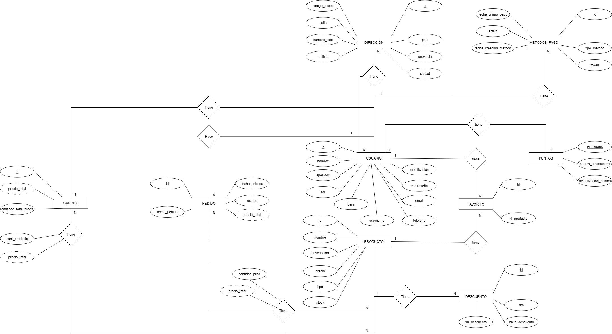

# Esquema entidad relación BD

## Usuario
**Descripción:** contiene toda la información que tiene que ver con los usuarios que usaran la pagia web

| Atributo | Descripcion |
| ----------- | ----------- |
| id | Identificador único |
| username | identifica el nombre del usuario dentro de la plataforma |
| nombre | identifica el nombre del usuario |
| apellidos | identifica los apellidos del usuario |
| email | email del usuario |
| teléfono | teléfono del usuario |
| rol | identifica si el usuario es de tipo admin, logeado, no logeado |
| contraseña | Se guarda la contraseña del usuario (en cado de admin o usuario logeado) |
| bann | Especifica si el usuario esta baneado |
| modificacion | especifica la fecha de la ultima modificacion de credenciales del usuario (puede ser contraseña, email, entre otros campos) |

Implementación del modelo en código: [models/usuario.js](/zootique_backend/api/src/models/usuario.js)

## Dirección
**Descripción:** tabla que contiene la dirección de envío de los productos que el cliente quiera comprar

| Atributo | Descripcion |
| ----------- | ----------- |
| id | Identificador único |
| id_usuario | Fk a tabla usuarios |
| pais | Identifica el pais donde se enviaran los productos |
| provincia | Provincia de la dirección de envío |
| ciudad | Identifica la ciudad de la dirección de envío |
| codigo_postal | código postal de la dirección de envío |
| calle | calle de la dirección de envío |
| numero_piso | numero y piso |
| activo | Para saber si esa dirección es la que el cliente ha seleccionado para el envío |

### Relaciones
| Tabla | FK | Tipo relación | Descripción |
| ----------- | ----------- | ----------- | ----------- |
| Usuario | id_usuario | N:N | Un usuario puede tener muchas direcciones de envío pero puede haber dos personas en una misma dirección por eso es N:N|

## Metodos_pago
**Descripción:** tabla donde se guardara toda la información relacionada con el método de pago que va a usar el cliente para realizar los pagos durante sus compras

| Atributo | Descripcion |
| ----------- | ----------- |
| id | Identificador único |
| id_usuario | FK a tabla usuario |
| tipo_metodo | Nombre del metodo elegido para pagar (PayPal...) |
| token | Guarda el token que te devuelve el metodo de pago, para que sea mas seguro el trámite |
| fecha_creacion_metodo | Guarda la fecha de cuando se ha creado este metodo de pago |
| fecha_ultimo_pago | Guarda la fecha de la última vez que se ha utilizado ese método de pago |
| activo | Campo que nos ayuda a saber si el método de pago es el que esta usando el usuario o no |

### Relaciones
| Tabla | FK | Tipo relación | Descripción |
| ----------- | ----------- | ----------- | ----------- |
| Usuario | id_usuario | 1:N | Un usuario puede tener muchos metodos de pago por eso es 1:N |

## Puntos
**Descripción:** tabla donde se guardaran los puntos que tiene cada usuario

| Atributo | Descripcion |
| ----------- | ----------- |
| id_usuario | Identificador único del usuario |
| puntos_acomulados | puntos totales que tiene acomulados el usuario |
| actualizacion_puntos | última actualización que se haya hecho sobre puntos ya sea que se han canjeado, o se han añadido |

### Relaciones
| Tabla | FK | Tipo relación | Descripción |
| ----------- | ----------- | ----------- | ----------- |
| Usuario | id_usuario | 1:1 | Un usuario tiene un sistema de puntos es por eso que la relación es 1:1 |

## Descuento
**Descripción:** Tabla donde se registran los descuentos de los productos
| Atributo | Descripcion |
| ----------- | ----------- |
| id | Identificador único |
| id_producto | FK a tabla producto |
| dto | descuento en porcentaje |
| incicio_descuento | Fecha en la que se inicia el descuento |
| fin_descuento | Fecha en la que finaliza el descuento |

### Relaciones
| Tabla | FK | Tipo relación | Descripción |
| ----------- | ----------- | ----------- | ----------- |
| Producto | id_producto | 1:N | Un producto puede tener muchos descuentos por ejemplo un producto puede tener diferentes descuentos en diferentes fechas |

## Producto
**Descripción:** tabla donde se guardará toda la información relacionada con los productos que se van a vender en la tienda

| Atributo | Descripcion |
| ----------- | ----------- |
| id | Identificador único |
| nombre | nnombre del producto |
| descripcion | descripción del producto |
| precio | precio del producto |
| tipo | tipo de producto se puede referir a la categoria a la que pertenece ese producto |

Implementación del modelo en código: [models/producto.js](/zootique_backend/api/src/models/producto.js)

## Favorito
**Descripción:** tabla en la que se guardan por cada usuario los productos que le han gustado

| Atributo | Descripcion |
| ----------- | ----------- |
| id | Identificador único |
| id_usuario | FK a tabla usuario |
| id_producto | FK a tabla producto |

### Relaciones
| Tabla | FK | Tipo relación | Descripción |
| ----------- | ----------- | ----------- | ----------- |
| Usuario - Producto | id_usuario - id_producto | N:N | Un usuario puede tener muchos productos en favoritos pero un producto puede aparecer en muchos favoritos de muchos usuarios |

## Pedido
**Descripción:** Tabla donde se guardara toda la información de los pedidos que hacen los clientes

| Atributo | Descripcion |
| ----------- | ----------- |
| id | Identificador único |
| id_usuario | FK a tabla usuario |
| fecha_pedido | Indica la fecha en la que se ha realizado el pedido |
| fecha_entrega | Indica la fecha en la que se ha entregado el pedido |
| estado | Campo que nos indica el estado del pedido (preparación, recogida, reparto...) |
| precio_total | Muestra el precio total del pedido |

### Relaciones
| Tabla | FK | Tipo relación | Descripción |
| ----------- | ----------- | ----------- | ----------- |
| Usuario | id_usuario | 1:N | Relación con usuario, porque un usuario puede tener muchos pedidos |

## Producto_pedido
**Descripción:** Tabla donde estaran todos los productos que iran en un pedido. Se controla en una tabla a parte porque seria más lioso si hubieran muchos pedidos con un producto, entonces se agrupa para manejarlo de manera mas sencilla.

| Atributo | Descripcion |
| ----------- | ----------- |
| id | Identificador único |
| id_pedido | FK a tabla pedido |
| id_producto | FK a tabla producto |
| cantidad_prod | Cantidad del producto seleccionado |
| precio_total | Precio unitario * cantidad |

### Relaciones
| Tabla | FK | Tipo relación | Descripción |
| ----------- | ----------- | ----------- | ----------- |
| Pedido - Producto | id_pedido - id_producto | N:N | Relación de que un pedido puede tener muchos productos y que un produtco puede estar en muchos pedidos |

## Carrito
**Descripción:** Tabla donde se guarda la información global de lo que el usuario tiene intención de comprar

| Atributo | Descripcion |
| ----------- | ----------- |
| id | Identificador único |
| precio_total | FK a tabla pedido |
| id_usuario | FK a tabla usuario |
| cantidad_total_prods | Cantidad del producto seleccionado |

### Relaciones
| Tabla | FK | Tipo relación | Descripción |
| ----------- | ----------- | ----------- | ----------- |
| Usuario | id_usuario | 1:1 | Relación de el carrito de compra con el usuario, un carrito pertenece a un solo usuario y un usuario sólo puede tener un carrito |

## Carrito_producto
**Descripción:** Tabla donde se guarda la información de los productos de lo que el usuario tiene intención de comprar.

| Atributo | Descripcion |
| ----------- | ----------- |
| id | Identificador único |
| id_producto | FK a tabla producto |
| id_carrito | FK a tabla carrito |
| cantidad_prod | Cantidad del producto seleccionado |

### Relaciones
| Tabla | FK | Tipo relación | Descripción |
| ----------- | ----------- | ----------- | ----------- |
| Producto - Carrito | id_producto - id_carrito | N:N | Relación entre el producto y el carrit, puede haber un producto en muchos carritos y un carrito puede tener muchos productos|